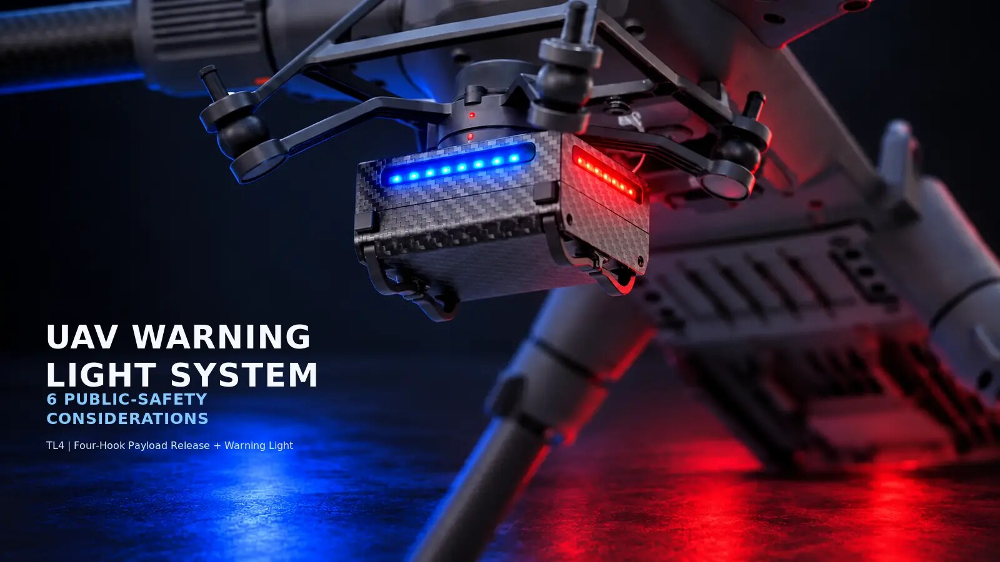

# UAV Warning Light System Field Checklist for Payload Operations

An effective UAV warning light system should be checked as part of the complete aircraft configuration. It is not simply an accessory to install and forget. On a professional mission, warning lights, mounting hardware, payload-release functions, control logic and ground-team coordination all need to work together.

This field reference provides a practical checklist for teams preparing an industrial UAV with warning lights and payload hardware.

> This is a general operating reference. Always follow local aviation requirements, manufacturer instructions and your organisation's safety procedures.

## 1. Confirm the mission requirement

Before installing equipment, define what the warning-light system needs to achieve for the mission.

- Will the aircraft operate in daylight, at dusk or in low-light conditions?
- Which people need to see the aircraft: the flight crew, nearby workers, security staff or an incident-response team?
- Is the aircraft expected to carry a release payload, camera or other equipment at the same time?
- Is a visible state signal needed during take-off, landing or payload operations?

This initial step helps the team select a suitable configuration rather than adding equipment without an operational purpose.

## 2. Inspect the mounting area

Inspect the underside of the aircraft before connecting the warning-light and payload system.

- Check the mounting position is secure and does not cover sensors, cameras, vents or moving components.
- Confirm that the landing structure has adequate clearance.
- Verify that hooks and release mechanisms can move without striking the aircraft or the mounted light module.
- Make sure there are no loose fasteners, damaged parts or cables that can snag during operation.

The inspection must be performed with the *complete* mission configuration installed. A component that clears the airframe on its own may not clear a second payload or landing structure.

## 3. Check warning-light visibility

Switch on the warning lights during the ground check and observe the aircraft from the expected working positions.

Look for the following:

- The light output is visible from the relevant direction.
- Red and blue lights are distinguishable under the actual ambient-light conditions.
- No aircraft structure blocks a critical viewing angle.
- The light state is understood by the team before the aircraft leaves the ground.

Visibility should support operational awareness; it does not replace a safe separation zone, visual observers or local flight requirements.

## 4. Verify payload-release functions separately

If the aircraft uses a release system, treat each release channel as a separate control function.

1. Confirm the controller is connected to the aircraft.
2. Test each individual release channel on the ground.
3. Verify any release-all function only when the area is clear.
4. Confirm that warning-light controls and release controls are clearly identified.
5. Inspect the hooks again after testing.

The goal is to prevent an operator from confusing a warning-light command with a payload action. Simple control names, a repeatable sequence and ground testing make the setup easier to use under pressure.

## 5. Brief the ground team

Before take-off, make sure everyone near the operating area understands the landing and payload procedures.

The briefing should state:

- who has authority to launch, land and activate any payload release;
- where people should stand while the aircraft is armed;
- how the team communicates a landing-area clearance; and
- what the aircraft's light state means within the team's own procedure.

Clear communication is particularly important when the pilot, payload operator and ground staff are different people.

## 6. Record the final pre-flight check

Use a short record or checklist to confirm that the system was checked before the mission. At a minimum, record the aircraft configuration, mounting condition, warning-light check and release-function test.

This gives teams a repeatable process and makes it easier to identify configuration changes between missions.

## Example Integrated Configuration

For teams that require independently controlled release points together with red-and-blue warning lights, the [TINTEC TL4 Four-Hook Payload Release and Warning-Light System](https://dgtintec.com/product/tl4-drone-warning-light-payload-release-system/) provides one integrated configuration to evaluate.

For more planning considerations, read the full guide: [UAV Warning Light System: 6 Practical Considerations for Public-Safety Operations](https://dgtintec.com/uav-warning-light-system-public-safety/).

For a practical control and installation overview, see [TL4 Payload Release Control and Installation Guide](https://dgtintec.com/drone-payload-release-control/).

## Related Resources

- [TINTEC Website](https://dgtintec.com/)
- [TINTEC UAV Payload Systems Knowledge Repository](https://tintec-uav.github.io/uav-payload-systems/)
- [TINTEC on LinkedIn](https://www.linkedin.com/company/dgtintec/)
- [TINTEC on YouTube](https://www.youtube.com/@TINTECUAV)

---

*TINTEC develops industrial UAV payload and accessory systems for professional operations.*
